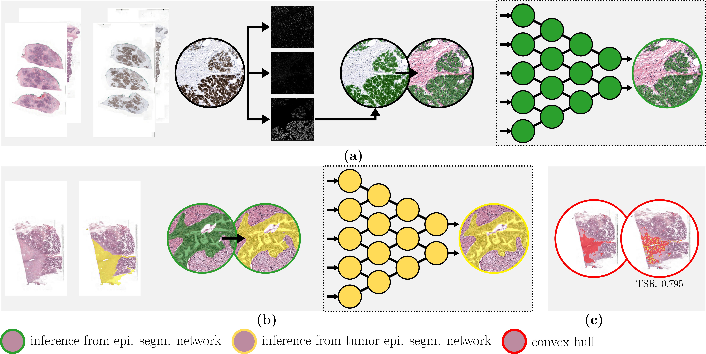
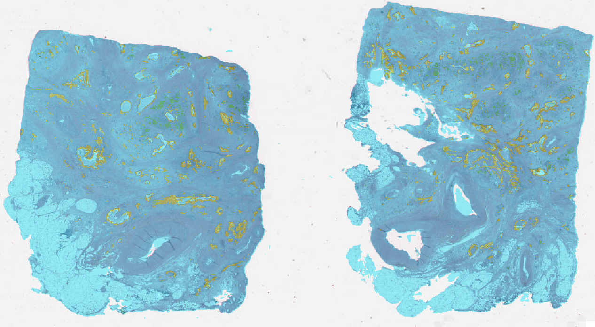
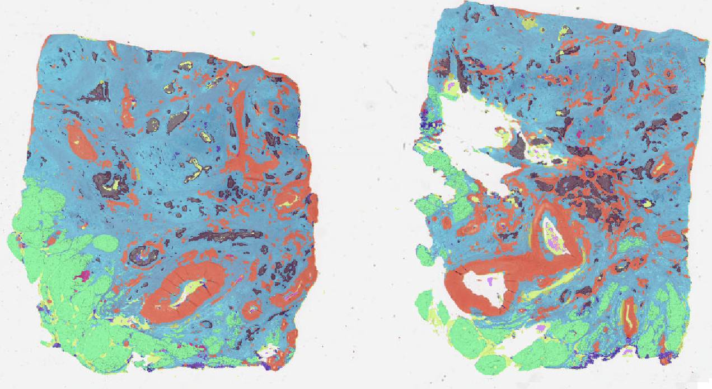
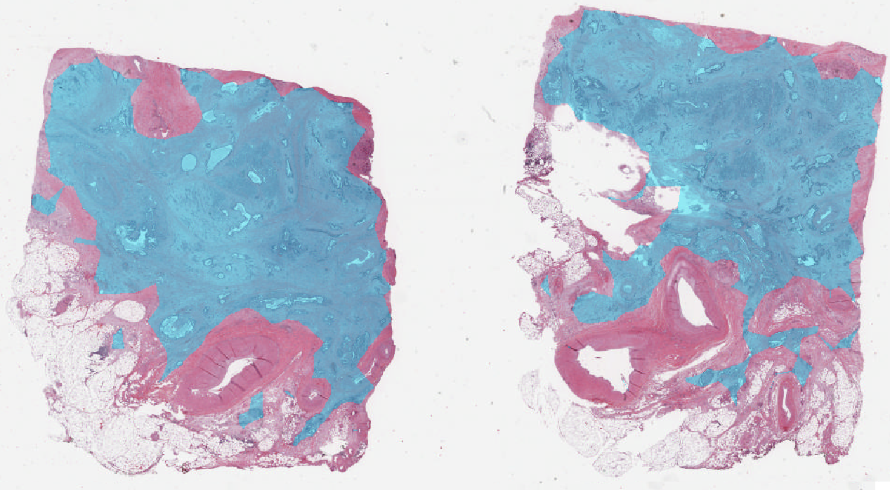

# Automatic Tumor stroma ratio as a prognostic biomarker for pancreatic cancer

## Table of Contents
- [Installation](#installation)
- [Inference](#inference)
- [Training](#training)
- [TSR quantification](#tsr-quantification)
- [Acknowledges](#acknowledges)
- [License](#license)

## Installation
1. Clone the repository.
   ```bash
   git clone https://github.com/DIAGNijmegen/automatic-tsr-quantification-for-pdac.git
   ```

 2. Build the docker.
    ```bash
    docker build . --tag=public_docker:latest
    ```
 4. Run the docker.
    ```bash
    docker run  -p 8888:8888 public_docker:latest
    ```
 6. (ONLY FOR INFERENCE) Download weights.
```bash
    pip install gdown
    gdown --folder https://drive.google.com/drive/folders/1LzGj7nmuYVQwjcxFvUW7Zny3V1M-f6mM?usp=drive_link
```

## Inference
To apply inference on data iterate through the following steps:
1. Modify code/schedule_tumor_characterization.sh so that the script can see the path to your images.
2. Modify code/run_all_automatic_tsr.sh with the same input paths.
```bash
    bash source/code/schedule_tumor_characterization.sh
```
After inference, multiple .tif images are created in the corresponding folders:
1. Epithelium:
   The produced _image_name_epithelium.tif_  Is a three channels image where label 1 represents the tissue (in light Blue), label 2 represents the Healthy epithelium (in Green) and label 3 represents the Tumor epithelium (in Yellow).
   
3. Multi_Tissue:
   The produced _image_name_multi_tissue.tif_  Is a eight channels image where label 1 represents the Stroma (in light Blue), label 2 represents the Fat (in Green), label 3 represents the Lumina (in Yellow), label 4 represents the Muscle (in Orange), label 5 represents Granulocytes (in Purple), label 6 represents Mucus (in dark Purple), label 7 represents Healthy epithelium (in Blue), label 8 represents Tumor epithelium (in Black).
   
5. Tumor:
   The produced _image_name_tumor.tif_  Is a one channels image where label 1 represents the convex hull created around the segmented Tumor epithelium (in light Blue).
   

## Training
To train a model from scratch, assuming input images and masks are available, follow these steps:
1. Create a network_configuration.yaml (following the example from code/network_configuration.yaml.
2. Create a dataset:
```python
    python3 source/pathology-common/scripts/createdataconfig.py --output "path/to/dataset.yaml" --images "/path/to/image/folder" --masks "/path/to/mask/folder" --labels [labels, in, the, mask] --spacing "2.0" (--random)
#labels is a list of integers representing the values in the mask (i.e. 0 = background, 1 = tissue, 2 = tumor)
```
3. Create splits:
```python
    python3 source/pathology-common/scripts/createfoldsg.py --input "path/to/dataset.yaml" --output "/path/to/folds" --folds "x" (--overwrite)
#x is an integer representing the number of folds you want to create (i.e. 5)
```
3. Modify code/pytorch_run_experiment.sh by adding your wandb login token, specifiying a project name and passing the appropriate files, where data_path represents one single split (i.e. fold_0) previously created.
4. Run the training script:
```bash
    bash source/code/pytorch_run_experiment.sh
```
5. After is finished, run it as many times as many folds you have created.

## TSR quantification
Quantification of tumor stroma ratio for a given image is possible either by running code/schedule_tumor_characterization.sh as last step for inference or independently by modifying code/run_all_automatic_tsr.sh making sure the script sees the input image, the tissue image, the multi-tissue image and the tumor image.
```bash
    bash source/code/run_all_automatic_tsr.sh
```
The script produces a .csv file with the image name and the associated Tumor stroma Ratio.

## Acknowledges
Authors would like to thank Stan Noordman for the realisation of the flowchart.
Authors would like to thank Thomas de Bel for the implementation and manteinance of [Pathology-common](./pathology-common) and [Pathology Fastinference](./pathology-fast-inference).

## License
This project is licensed under the [APACHE 2.0](license.txt) - see the [license.txt](license.txt) file for details.
  


